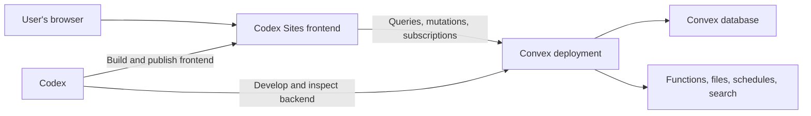

# Codex Sites + Convex

Build and ship a [Codex Site](https://openai.com/academy/chatgpt-sites/) with [Convex](https://www.convex.dev/) as its realtime database and backend—using one reusable Codex skill.

> **Quick start:** Install the skill, restart Codex, then prompt: `$codex-sites-convex Build a realtime project tracker for my team.`

## Why this skill?

Codex Sites and Convex have complementary responsibilities:

- **Codex Sites** creates, builds, publishes, and shares the frontend.
- **Convex** provides the database, queries, mutations, actions, authentication, schedules, search, files, and realtime subscriptions.
- **This skill** makes Codex preserve that boundary, check current official documentation, select appropriate Convex components, validate both halves, and publish in the correct order.

Without a dedicated workflow, an agent can scaffold a second frontend, introduce another database, guess at Convex APIs, skip authorization, expose credentials, or validate only the local UI. This skill adds the missing cross-product runbook.

## What’s included

- A complete build-and-publish workflow in [`SKILL.md`](SKILL.md)
- New-project and existing-project paths
- Codex Sites architecture safeguards
- Current Convex documentation routing
- Official Convex component discovery before implementation
- Component-specific skill loading when a component is selected
- Convex schema, validator, index, authorization, and pagination rules
- A deployed HTTPS and WebSocket connectivity gate
- Accountless local Agent Mode and isolated cloud-agent guidance
- A backend-readiness gate before Sites or the browser starts
- Production deployment ordering and Chrome QA
- A removable, light/dark-aware “Built with Codex Sites + Convex” footer using bundled artwork and a Phosphor GitHub icon
- Deterministic preflight and project verification scripts

## Architecture



The Convex MCP server helps Codex during development. Visitors use the public Convex React client and generated API types.

## Accounts, access, and ownership

| Context | Account or key | Can power a published Site? |
| --- | --- | --- |
| Accountless local Agent Mode | No Convex login or deploy key | No; the local backend must keep running on the developer's machine |
| Signed-in developer cloud dev | Saved Convex CLI credentials | No; use production for the published Site |
| Isolated cloud agent dev | Deployment-scoped development key | No; the key is limited to that dev deployment |
| Convex Cloud production | Convex project/account or production-scoped key | Yes |
| Codex Sites visitors | Public access or authorized ChatGPT/OpenAI account | Visitors never need Convex accounts |
| Product authentication | App-specific visitor identity | Controls shared versus per-user data inside the app |

A Convex Pro plan is not required merely to publish. Codex Sites access controls who can open the frontend; application authentication and Convex authorization control which records a visitor can read or change. See [accounts, access, and ownership](references/accounts-access-and-ownership.md), [Agent Mode](references/agent-mode.md), and [deployment and QA](references/deployment-and-qa.md).

## How Sites and Convex work together

```text
Visitor browser
→ Codex Sites frontend
→ NEXT_PUBLIC_CONVEX_URL
→ Convex Cloud deployment
→ Convex queries, mutations, actions, and data
```

Sites hosts the frontend. Convex hosts durable data and backend functions. `NEXT_PUBLIC_CONVEX_URL` is public configuration that tells `ConvexReactClient` where to connect; it is not a password and does not grant dashboard access. Generated API types describe callable functions, while Convex validators, authentication, and authorization protect backend operations.

## Find your published Site

In the ChatGPT desktop app, open Sites, find the Site, and select it. Open Settings to manage it or Analytics to review unique visitors and page views.

On the web, open [chatgpt.com/sites](https://chatgpt.com/sites), find the Site, select More actions, then choose Settings or Analytics. The Site stays in this list after the original task or conversation ends.

Hosted Sites are managed through ChatGPT on the web or desktop. There is no standalone Codex CLI or IDE management screen.

## Manage Site settings

- **Name:** display name.
- **URL or domain:** hosted `chatgpt.site` address.
- **Custom domain:** a domain or subdomain you already own.
- **Sharing:** who can open the Site; it does not grant edit or Convex-backend access.
- **Environment variables:** hosted frontend or Sites-worker configuration.
- **Analytics:** unique visitors and page views.
- **Delete Site:** permanent and cannot be undone.

Settings can vary by plan, region, workspace policy, and the current Sites beta.

## Environment variables

| Layer | Location | Use |
| --- | --- | --- |
| Local frontend | `.env.local` | Local frontend configuration and local/development Convex URL; keep it out of Git |
| Hosted Sites | Site → Settings → Environment variables | Hosted frontend or server-side Sites-worker configuration |
| Convex deployment | Convex dashboard or CLI environment commands | Backend secrets and configuration used by Convex functions |

Browser-public variables such as `NEXT_PUBLIC_CONVEX_URL` and `VITE_*` are visible to visitors even if a UI offers a Secret switch. Keep `CONVEX_DEPLOY_KEY` and third-party backend secrets out of browser variables. Convex development and production environments are separate, and Convex functions do not read the frontend's `.env.local`.

`.openai/hosting.json` links the local source to the hosted Sites project. It may contain `project_id` and logical D1/R2 binding names, but never runtime environment values or secrets. Its `project_id` is a Sites identifier, not a Convex project ID.

## Change the connected Convex deployment

1. Confirm who owns the target Convex project and validate its production deployment.
2. Copy the exact production `convex.cloud` URL.
3. Update `NEXT_PUBLIC_CONVEX_URL` in Site Settings and the production build environment.
4. Rebuild because browser-public values may be embedded in JavaScript.
5. Save and deploy a new Sites version.
6. Confirm the old URL is absent, then test reads, writes, and realtime updates.

Never publish a Site connected to localhost, `127.0.0.1`, or an unintended development deployment. See [Sites settings and environment](references/sites-settings-and-environment.md) for all update runbooks and the full variable reference.

## Public versus private access

`public` lets anyone with the link open the Site without ChatGPT sign-in. `custom`, `workspace_all`, and `admins_only` require the corresponding authorized ChatGPT/OpenAI identity. Changing sharing affects only the Sites visitor gate; it does not deploy Convex, move data, change the Convex plan, or create Convex accounts.

Before making an app public, verify product authentication and per-user Convex authorization. Without them, visitors may share and modify the same records. Public access and any audience expansion require explicit authorization.

## Installation

### Where to paste prompts and commands

- Paste blocks labeled `text` into a Codex task.
- Run blocks labeled `bash` in Codex's integrated terminal at the project root, the folder containing `package.json`.
- Add blocks labeled `toml` to the named configuration file; do not run them as commands.

Codex can run the terminal commands for you. New users can ask: `Run these commands for me one at a time and explain any approval request before continuing.` See the [integrated terminal guide](https://learn.chatgpt.com/docs/integrated-terminal) and [ChatGPT/Codex docs](https://learn.chatgpt.com/docs).

### Option 1: Install for your Codex user

```bash
git clone https://github.com/waynesutton/Codex-Sites-Convex-Backend-Skill.git \
  ~/.codex/skills/codex-sites-convex
```

Restart Codex after installation.

### Option 2: Install for one project

From the project root:

```bash
mkdir -p .agents/skills
git clone https://github.com/waynesutton/Codex-Sites-Convex-Backend-Skill.git \
  .agents/skills/codex-sites-convex
```

Commit the skill folder if the whole team should use the same workflow.

### Option 3: Copy an existing checkout

User-wide:

```bash
cp -R codex-sites-convex ~/.codex/skills/codex-sites-convex
```

Project-local:

```bash
mkdir -p .agents/skills
cp -R codex-sites-convex .agents/skills/codex-sites-convex
```

## Usage

Open the skill picker in Codex or invoke the skill directly:

```text
$codex-sites-convex Build a customer feedback portal with realtime voting.
```

More examples:

```text
$codex-sites-convex Build a launch tracker with milestones, owners, risks, and weekly updates.

$codex-sites-convex Add Convex authentication and per-user workspaces to this existing Codex Site.

$codex-sites-convex Add realtime comments, presence, and notifications to this project.

$codex-sites-convex Review this Codex Sites + Convex app, fix backend issues, and publish it.
```

## Two prompts for local and production deployment

Use the local prompt while building. It creates a localhost preview with an accountless Convex backend. An anonymous local backend cannot power a published `.chatgpt.site` URL, so use the production prompt when you are ready for a hosted URL.

### New to Codex? Start here

1. Open your app folder in Codex. This is the folder that contains `package.json`.
2. Start a new task for that folder.
3. Paste one complete prompt below into the task and send it.
4. Let Codex run the commands in its integrated terminal. Review any approval request before accepting it.

You do not need to open a separate Terminal app or type every command yourself. If you prefer to run commands manually, open Codex's integrated terminal in the same project folder and run each command exactly as shown. Read the [Codex integrated terminal guide](https://learn.chatgpt.com/docs/integrated-terminal) or browse the [ChatGPT and Codex documentation](https://learn.chatgpt.com/docs).

### Prompt 1: run locally without a Convex account

```text
$codex-sites-convex Set up this app for accountless local development with
Codex Sites and Convex. If this folder is not already a Codex Sites project,
initialize Sites in this same folder and preserve its normal project structure.
Run npm install and npx convex dev --once to provision an anonymous local
backend. Confirm .env.local has NEXT_PUBLIC_CONVEX_URL and that the generated
Convex API exists before starting the frontend. Keep one Convex watcher and one
Sites development server running, then verify a query, mutation, and realtime
update locally. Give me the localhost URL. Do not require a Convex login, create
a second frontend or database, publish the Site, or claim the local backend can
power a .chatgpt.site URL.
```

### Prompt 2: deploy Convex production and create the Sites URL

```text
$codex-sites-convex Move this validated local app to production and publish it
with Codex Sites.

First inspect the current Convex configuration without displaying credentials.
Tell me whether this folder is connected to Convex Cloud. Confirm the Convex
account, team, project, and exact production deployment with me before making
production changes.

If Convex Cloud is not configured, walk me through signing in, choosing or
creating the correct project, and linking this folder. Do not select an
unrelated project or create a project without telling me.

List the production environment variable names the app requires. Show me how
to enter secret values securely through the Convex dashboard or CLI. Never ask
me to paste secret values into chat.

Announce the exact production target and explain what the deployment will
change. Get my fresh confirmation before deploying.

Deploy Convex first, capture the exact production convex.cloud URL, and rebuild
the Codex Site with that URL. Confirm the browser bundle contains no localhost
URL, development deployment URL, deploy key, or backend secret.

If the folder is not linked to a Codex Sites project, create one once and save
its project ID. Publish the Site privately unless I approve another audience.

Wait for the Sites deployment to finish. Verify a query, mutation, and realtime
update through the published Site. Confirm its live URL and access mode, open
the Site, then give me the exact .chatgpt.site URL and management instructions.
Do not add product authentication unless I request it.
```

Codex will inspect the workspace, preserve existing architecture, check current official Convex components and documentation, implement the smallest complete product, run validation, deploy Convex first, and publish the frontend through Codex Sites.

Remove the optional footer at any time with this one-line prompt:

```text
$codex-sites-convex Remove the entire “Built with Codex Sites + Convex” footer, its GitHub repository link, Phosphor GitHub icon import, and all unused public/built-with logo assets. Uninstall @phosphor-icons/react only if nothing else uses it, then run the frontend build.
```

The footer follows the Site's resolved theme. It uses the color Convex wordmark in light mode, the white wordmark in dark mode, and a Phosphor GitHub icon that inherits the current text color. A manual Site theme takes priority over the operating-system preference.

## How the workflow works

1. **Inspect** — Classify the workspace as empty, Sites-only, Convex-only, or already combined.
2. **Prepare Sites** — Keep the existing `.openai/hosting.json`, package manager, and vinext/Vite structure, but defer starting the server.
3. **Provision Convex** — Use accountless `npx convex dev --once` locally or an isolated scoped cloud-agent deployment when required.
4. **Check capabilities** — Refresh the official component catalog and `llms.txt` before implementation.
5. **Load component instructions** — Read the complete official component `SKILL.md` when one is selected.
6. **Gate startup** — Require `.env.local`, `NEXT_PUBLIC_CONVEX_URL`, and generated APIs before starting exactly one Sites server.
7. **Prove connectivity** — Test a minimal query, mutation, and realtime update from the published Sites origin.
8. **Build** — Implement the requested product with generated APIs, real Convex-backed data, and the removable built-with footer.
9. **Validate** — Run Convex generation, backend checks, frontend build, lint, type checks, and structural verification.
10. **Publish** — Deploy Convex, rebuild with the production Convex URL, publish the Site, verify its exact URL and access policy, and test it in Chrome.

Deployment order: Convex backend → production Convex URL → Sites production build → Sites publish → URL and access verification.

## Publishing, URLs, and access

After publishing, the skill polls the deployment until success or failure, uses the exact successful deployment URL, and confirms it against `get_site.current_live_url`. For an already-published Site, it reads `project_id` from `.openai/hosting.json` and uses `get_site.current_live_url` as canonical. It never guesses a URL from the slug.

### Deploy Convex for development

Use a development backend while building:

```bash
npm install
npx convex dev --once
```

This pushes the backend once, generates the API types, and writes the development Convex URL to `.env.local`. During an interactive preview, keep this running beside one Sites server:

```bash
npx convex dev
```

Accountless local agent development does not require a Convex account. Do not use this development backend for the published Site.

### Deploy Convex to production

After local reads, writes, and realtime updates pass:

```bash
npx convex deploy
```

This deploys to the production deployment for the configured Convex project. A developer needs access to that Convex project, or a production-scoped deploy key. Configure backend secrets in the production Convex environment, obtain the production Convex URL, set it as the public Convex URL for the Sites production build, and build again before publishing Sites.

The production Sites bundle must point to the production Convex URL—not localhost and not a Convex development deployment.

### Publish without requiring visitors to sign in

Ask Codex:

```text
$codex-sites-convex Build, validate, and publish the latest version to Codex Sites. Make the Site public so anyone with the link can use it without signing in.
```

Codex must explain that `public` allows anyone with the URL to visit and obtain your authorization before it publishes publicly or changes existing access. Workspace policy may prevent public publishing; if so, Codex should report that blocker instead of weakening another setting.

### Publish with sign-in required

Choose the audience in your prompt:

```text
$codex-sites-convex Build, validate, and publish the latest version to Codex Sites for all active members of my ChatGPT/OpenAI workspace.

$codex-sites-convex Build, validate, and publish the latest version to Codex Sites. Keep it private and grant access to alex@example.com.

$codex-sites-convex Build, validate, and publish the latest version to Codex Sites for owners and administrators only.
```

The corresponding access modes are `workspace_all`, `custom`, and `admins_only`. Private visitors open the returned Sites URL and sign in with the authorized ChatGPT/OpenAI account. Signing in to Convex does not grant Site access.

Sites access is separate from Convex developer access:

| Access mode | Who can visit? |
| --- | --- |
| `public` | Anyone with the URL, without signing in |
| `workspace_all` | Active workspace members signed in with their ChatGPT/OpenAI workspace account |
| `custom` | Explicitly allowed users and groups |
| `admins_only` | The owner or administrators |

Visitors never need Convex accounts. Developers need a Convex account only to manage or publish the cloud backend. Signing in to the Convex dashboard does not grant access to a private Site.

The skill never makes a Site public or adds users or groups without explicit authorization. For `custom` access, it preserves the complete existing allowlist when adding users. Adding an email grants access but does not send an invitation email.

For future updates, ask Codex: ‘Build, validate, and publish the latest version to Codex Sites.’

## Convex Agent Mode and accounts

| Context | What the skill uses | Convex account required? |
| --- | --- | --- |
| Local agent development | `npx convex dev --once` provisions an accountless local backend | No |
| Interactive local preview | Keep `npx convex dev` running beside one Sites server | No for a local backend |
| Cloud-agent development | Isolated cloud dev deployment with a deployment-scoped key | Yes |
| Production publishing | Convex cloud project and production deployment | Yes |
| Site visitors | Public Convex client connection | No, unless the product itself adds authentication |

See the official [Convex Agent Mode documentation](https://docs.convex.dev/cli/agent-mode).

## Reliable local startup

Provision Convex before starting the Sites development server:

```bash
npm install
npx convex dev --once
./scripts/check-backend-ready.sh .
```

After the readiness check passes:

1. Start `npx convex dev` and keep it running.
2. Start exactly one Sites development server on its intended port.
3. Open the browser only after both processes are healthy.

The readiness check requires:

- `.env.local` exists;
- `NEXT_PUBLIC_CONVEX_URL` has a nonempty value;
- generated Convex API types exist.

If Sites started before Convex wrote `.env.local`, stop Sites and restart it exactly once. The running client bundle will not reliably receive an environment variable created after startup.

Do not force a Convex login for local agent development and do not use legacy anonymous-mode flags. In a non-interactive shell, `npx convex dev --once` automatically provisions the supported accountless local backend.

## Official component discovery

Before adding backend infrastructure, the skill checks:

- [Official Convex component catalog](https://www.convex.dev/components/get-convex.md)
- [Convex documentation index for LLMs](https://docs.convex.dev/llms.txt)
- Existing project dependencies and component registrations

If an official component directly fits the requested capability, the skill fetches and follows that component’s linked `SKILL.md`. Otherwise it uses the documented built-in Convex primitive. Frontend ownership always remains with Codex Sites.

Run component discovery manually:

```bash
./scripts/check-components.sh "rate limiter"
./scripts/check-components.sh "workflow"
./scripts/check-components.sh "resend"
```

## Helper scripts

### Preflight

```bash
./scripts/preflight.sh /path/to/project
```

Reports the available runtime, project type, package manager, Sites marker, Convex backend, generated API, and agent guidance.

### Component discovery

```bash
./scripts/check-components.sh "capability keywords"
```

Refreshes the official Convex catalog and returns relevant backend candidates.

### Structural verification

```bash
./scripts/verify-project.sh /path/to/project
```

Checks the required Sites and Convex structure, generated API, dependency boundary, and obvious credential risks.

### Backend readiness

```bash
./scripts/check-backend-ready.sh /path/to/project
```

Confirms `NEXT_PUBLIC_CONVEX_URL` and generated API types exist before the Sites server or browser starts.

## Troubleshooting

| Symptom | Likely cause | Correct response |
| --- | --- | --- |
| Missing Convex URL or setup screen | Sites started before `.env.local` existed | Provision Convex, pass the readiness check, then restart Sites once |
| JSON parsing, worker startup, or repeated Vite restart errors | Environment, dependencies, and hosting configuration changed while Vite was restarting | Let file changes settle, stop duplicate servers, and perform one clean restart |
| Sites moves to a fallback port | Another Sites server is still running | Reuse the healthy intended server or stop the duplicate started by the current task |
| “Multiple renderers” appears during overlapping restarts | Cascading development-server state | Resolve duplicate processes and restart cleanly before changing app code |
| Hydration warning mentions Grammarly-injected attributes | Browser extension modified the DOM | Verify in a clean Chrome profile or with extensions disabled; do not change the app if it disappears |
| React crashes because the Convex URL is missing | Provider initialization throws during render | Render a helpful configuration state and create the Convex client only after the URL exists |
| Local backend works but published Site does not | Production bundle used the local or stale Convex URL | Deploy Convex, set the production URL, and run a clean Sites production build before publishing |

Never accept a fallback port or local-only success as proof that the published integration works. Final QA must confirm production reads, writes, and realtime updates from the published Sites URL.

## Project structure

```text
codex-sites-convex/
├── SKILL.md
├── agents/
│   └── openai.yaml
├── assets/
│   ├── codex-color.svg
│   ├── convex-color.svg
│   └── convex-white.svg
├── references/
│   ├── accounts-access-and-ownership.md
│   ├── architecture.md
│   ├── agent-mode.md
│   ├── bootstrap.md
│   ├── built-with-footer.md
│   ├── components.md
│   ├── convex-doc-map.md
│   ├── convex-rules.md
│   ├── deployment-and-qa.md
│   └── sites-settings-and-environment.md
└── scripts/
    ├── check-backend-ready.sh
    ├── check-components.sh
    ├── preflight.sh
    └── verify-project.sh
```

## Requirements

- Codex desktop app or Codex CLI with skill support
- A ChatGPT workspace with Codex Sites enabled
- Node.js, npm, and `npx`
- No Convex account for accountless local agent development
- A Convex account for isolated cloud deployments and production publishing
- Chrome for final published-site verification

## Recommended Convex setup

Install the full current Convex plugin for Codex:

```bash
codex plugin marketplace add get-convex/convex-codex-plugin
codex plugin add convex@convex-codex-plugin
```

Install current Convex project guidance:

```bash
npx convex ai-files install
```

Configure the Convex MCP server in `~/.codex/config.toml`:

```toml
[mcp_servers.convex]
command = "npx"
args = ["-y", "convex@latest", "mcp", "start"]
```

Restart Codex after installing the plugin, skill, or MCP configuration.

## Safeguards

The skill requires Codex to:

- keep durable application data in Convex;
- use generated API references instead of string function names;
- validate function arguments and return values;
- use indexes and bounded or paginated queries;
- enforce authorization inside protected Convex functions;
- keep privileged credentials and third-party secrets out of browser code;
- avoid speculative dependencies and duplicate infrastructure;
- test the published frontend’s HTTPS and WebSocket connection;
- include the removable built-with footer and preserve its source removal comment unless the user opts out;
- ask before expanding access or enabling broad production MCP permissions.

## Official OpenAI and Codex resources

- [ChatGPT Sites documentation](https://learn.chatgpt.com/docs/sites?surface=app)
- [Manage Sites in ChatGPT](https://chatgpt.com/sites)
- [OpenAI Academy: ChatGPT Sites](https://openai.com/academy/chatgpt-sites/)
- [Codex overview](https://openai.com/codex/)
- [Codex documentation](https://developers.openai.com/codex/)
- [Codex customization](https://developers.openai.com/codex/concepts/customization)
- [Codex skills](https://developers.openai.com/codex/concepts/customization#skills)
- [AGENTS.md guidance](https://developers.openai.com/codex/concepts/customization#agents-guidance)
- [Codex MCP customization](https://developers.openai.com/codex/concepts/customization#mcp)
- [Codex plugins](https://developers.openai.com/codex/plugins)
- [Codex configuration reference](https://developers.openai.com/codex/config-reference)

## Official Convex resources

### Codex and AI tooling

- [Using Codex with Convex](https://docs.convex.dev/ai/using-codex)
- [Install the Convex plugin](https://docs.convex.dev/ai/using-codex#install-the-convex-plugin)
- [Convex MCP server](https://docs.convex.dev/ai/convex-mcp-server)
- [Convex Agent Skills](https://docs.convex.dev/ai/agent-skills)
- [Convex Agent Plugins](https://docs.convex.dev/ai/convex-plugins)
- [Convex documentation index for LLMs](https://docs.convex.dev/llms.txt)

### Components

- [Official Convex component catalog](https://www.convex.dev/components/get-convex.md)
- [Convex Components directory](https://www.convex.dev/components)
- [Components overview](https://docs.convex.dev/components/overview)
- [Understanding Components](https://docs.convex.dev/components/understanding)
- [Using Components](https://docs.convex.dev/components/using)
- [Authoring Components](https://docs.convex.dev/components/authoring)

### Core development

- [Convex developer documentation](https://docs.convex.dev/)
- [Development workflow](https://docs.convex.dev/understanding/workflow)
- [TypeScript best practices](https://docs.convex.dev/understanding/best-practices/typescript)
- [Convex React client](https://docs.convex.dev/client/react/overview)
- [Configuring deployment URLs](https://docs.convex.dev/client/react/deployment-urls)
- [Realtime](https://docs.convex.dev/realtime)
- [Schemas](https://docs.convex.dev/database/schemas)
- [Indexes](https://docs.convex.dev/database/reading-data/indexes)
- [Pagination](https://docs.convex.dev/database/pagination)
- [Queries](https://docs.convex.dev/functions/query-functions)
- [Mutations](https://docs.convex.dev/functions/mutation-functions)
- [Actions](https://docs.convex.dev/functions/actions)
- [Argument and return validation](https://docs.convex.dev/functions/validation)
- [Internal functions](https://docs.convex.dev/functions/internal-functions)
- [HTTP actions](https://docs.convex.dev/functions/http-actions)
- [Error handling](https://docs.convex.dev/functions/error-handling)

### Authentication, storage, and background work

- [Authentication overview](https://docs.convex.dev/auth/overview)
- [Authentication in functions](https://docs.convex.dev/auth/functions-auth)
- [Storing users](https://docs.convex.dev/auth/database-auth)
- [File storage](https://docs.convex.dev/file-storage/overview)
- [Uploading files](https://docs.convex.dev/file-storage/upload-files)
- [Scheduled functions](https://docs.convex.dev/scheduling/scheduled-functions)
- [Cron jobs](https://docs.convex.dev/scheduling/cron-jobs)
- [Full-text search](https://docs.convex.dev/search/text-search)
- [Vector search](https://docs.convex.dev/search/vector-search)

### Testing and production

- [Testing](https://docs.convex.dev/testing/overview)
- [Testing the local backend](https://docs.convex.dev/testing/convex-backend)
- [`convex-test`](https://docs.convex.dev/testing/convex-test)
- [Production deployment](https://docs.convex.dev/production/overview)
- [Environment variables](https://docs.convex.dev/production/environment-variables)
- [Project configuration](https://docs.convex.dev/production/project-configuration)
- [Multiple deployments](https://docs.convex.dev/production/multiple-deployments)
- [Usage limits](https://docs.convex.dev/production/usage-limits)
- [Convex CLI](https://docs.convex.dev/cli/overview)
- [`npx convex dev`](https://docs.convex.dev/cli/reference/dev)
- [`npx convex deploy`](https://docs.convex.dev/cli/reference/deploy)
- [`npx convex codegen`](https://docs.convex.dev/cli/reference/codegen)
- [`npx convex mcp`](https://docs.convex.dev/cli/reference/mcp)
- [Convex Agent Mode](https://docs.convex.dev/cli/agent-mode)

## Contributing

Issues and pull requests are welcome. Keep changes focused on the Codex Sites frontend + Convex backend workflow, prefer current official documentation over copied API details, and validate the skill before submitting:

```bash
python3 /path/to/skill-creator/scripts/quick_validate.py .
bash -n scripts/*.sh
```

When changing component discovery, also run:

```bash
./scripts/check-components.sh "rate limiter"
```

## Repository

[github.com/waynesutton/Codex-Sites-Convex-Backend-Skill](https://github.com/waynesutton/Codex-Sites-Convex-Backend-Skill)
