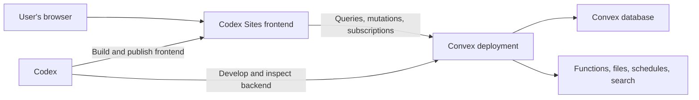

# Codex Sites + Convex

Build and ship a [Codex Site](https://openai.com/academy/chatgpt-sites/) with [Convex](https://www.convex.dev/) as its realtime database and backend—using one reusable Codex skill.

> **Quick start:** Install the skill, restart Codex, then prompt: `$codex-sites-convex Build a realtime project tracker for my team.`

## Why this skill?

Codex Sites and Convex have complementary responsibilities:

- **Codex Sites** creates, builds, publishes, and shares the frontend.
- **Convex** provides the database, queries, mutations, actions, authentication, schedules, search, files, and realtime subscriptions.
- **This skill** makes Codex preserve that boundary, check current official documentation, select appropriate Convex components, validate both halves, and publish in the correct order.

Without a dedicated workflow, an agent can scaffold a second frontend, introduce another database, guess at Convex APIs, skip authorization, expose credentials, or validate only the local UI. This skill adds the missing cross-product runbook.

## What’s included

- A complete build-and-publish workflow in [`SKILL.md`](SKILL.md)
- New-project and existing-project paths
- Codex Sites architecture safeguards
- Current Convex documentation routing
- Official Convex component discovery before implementation
- Component-specific skill loading when a component is selected
- Convex schema, validator, index, authorization, and pagination rules
- A deployed HTTPS and WebSocket connectivity gate
- Production deployment ordering and Chrome QA
- Deterministic preflight and project verification scripts

## Architecture



The Convex MCP server helps Codex during development. Visitors use the public Convex React client and generated API types.

## Installation

### Option 1: Install for your Codex user

```bash
git clone https://github.com/waynesutton/Codex-Sites-Convex-Backend-Skill.git \
  ~/.codex/skills/codex-sites-convex
```

Restart Codex after installation.

### Option 2: Install for one project

From the project root:

```bash
mkdir -p .agents/skills
git clone https://github.com/waynesutton/Codex-Sites-Convex-Backend-Skill.git \
  .agents/skills/codex-sites-convex
```

Commit the skill folder if the whole team should use the same workflow.

### Option 3: Copy an existing checkout

User-wide:

```bash
cp -R codex-sites-convex ~/.codex/skills/codex-sites-convex
```

Project-local:

```bash
mkdir -p .agents/skills
cp -R codex-sites-convex .agents/skills/codex-sites-convex
```

## Usage

Open the skill picker in Codex or invoke the skill directly:

```text
$codex-sites-convex Build a customer feedback portal with realtime voting.
```

More examples:

```text
$codex-sites-convex Build a launch tracker with milestones, owners, risks, and weekly updates.

$codex-sites-convex Add Convex authentication and per-user workspaces to this existing Codex Site.

$codex-sites-convex Add realtime comments, presence, and notifications to this project.

$codex-sites-convex Review this Codex Sites + Convex app, fix backend issues, and publish it.
```

Codex will inspect the workspace, preserve existing architecture, check current official Convex components and documentation, implement the smallest complete product, run validation, deploy Convex first, and publish the frontend through Codex Sites.

## How the workflow works

1. **Inspect** — Classify the workspace as empty, Sites-only, Convex-only, or already combined.
2. **Preserve Sites** — Keep the existing `.openai/hosting.json`, package manager, vinext/Vite structure, and frontend workflow.
3. **Initialize Convex** — Add Convex to the same project and install current Convex AI guidance.
4. **Check capabilities** — Refresh the official component catalog and `llms.txt` before implementation.
5. **Load component instructions** — Read the complete official component `SKILL.md` when one is selected.
6. **Prove connectivity** — Test a minimal query, mutation, and realtime update from the published Sites origin.
7. **Build** — Implement the requested product with generated APIs and real Convex-backed data.
8. **Validate** — Run Convex generation, backend checks, frontend build, lint, type checks, and structural verification.
9. **Publish** — Deploy Convex, configure the public deployment URL, publish the Site, and test it in Chrome.

## Official component discovery

Before adding backend infrastructure, the skill checks:

- [Official Convex component catalog](https://www.convex.dev/components/get-convex.md)
- [Convex documentation index for LLMs](https://docs.convex.dev/llms.txt)
- Existing project dependencies and component registrations

If an official component directly fits the requested capability, the skill fetches and follows that component’s linked `SKILL.md`. Otherwise it uses the documented built-in Convex primitive. Frontend ownership always remains with Codex Sites.

Run component discovery manually:

```bash
./scripts/check-components.sh "rate limiter"
./scripts/check-components.sh "workflow"
./scripts/check-components.sh "resend"
```

## Helper scripts

### Preflight

```bash
./scripts/preflight.sh /path/to/project
```

Reports the available runtime, project type, package manager, Sites marker, Convex backend, generated API, and agent guidance.

### Component discovery

```bash
./scripts/check-components.sh "capability keywords"
```

Refreshes the official Convex catalog and returns relevant backend candidates.

### Structural verification

```bash
./scripts/verify-project.sh /path/to/project
```

Checks the required Sites and Convex structure, generated API, dependency boundary, and obvious credential risks.

## Project structure

```text
codex-sites-convex/
├── SKILL.md
├── agents/
│   └── openai.yaml
├── references/
│   ├── architecture.md
│   ├── bootstrap.md
│   ├── components.md
│   ├── convex-doc-map.md
│   ├── convex-rules.md
│   └── deployment-and-qa.md
└── scripts/
    ├── check-components.sh
    ├── preflight.sh
    └── verify-project.sh
```

## Requirements

- Codex desktop app or Codex CLI with skill support
- A ChatGPT workspace with Codex Sites enabled
- Node.js, npm, and `npx`
- A Convex account for hosted development and production deployments
- Chrome for final published-site verification

## Recommended Convex setup

Install the full current Convex plugin for Codex:

```bash
codex plugin marketplace add get-convex/convex-codex-plugin
codex plugin add convex@convex-codex-plugin
```

Install current Convex project guidance:

```bash
npx convex ai-files install
```

Configure the Convex MCP server in `~/.codex/config.toml`:

```toml
[mcp_servers.convex]
command = "npx"
args = ["-y", "convex@latest", "mcp", "start"]
```

Restart Codex after installing the plugin, skill, or MCP configuration.

## Safeguards

The skill requires Codex to:

- keep durable application data in Convex;
- use generated API references instead of string function names;
- validate function arguments and return values;
- use indexes and bounded or paginated queries;
- enforce authorization inside protected Convex functions;
- keep privileged credentials and third-party secrets out of browser code;
- avoid speculative dependencies and duplicate infrastructure;
- test the published frontend’s HTTPS and WebSocket connection;
- ask before expanding access or enabling broad production MCP permissions.

## Official OpenAI and Codex resources

- [OpenAI Academy: ChatGPT Sites](https://openai.com/academy/chatgpt-sites/)
- [Codex overview](https://openai.com/codex/)
- [Codex documentation](https://developers.openai.com/codex/)
- [Codex customization](https://developers.openai.com/codex/concepts/customization)
- [Codex skills](https://developers.openai.com/codex/concepts/customization#skills)
- [AGENTS.md guidance](https://developers.openai.com/codex/concepts/customization#agents-guidance)
- [Codex MCP customization](https://developers.openai.com/codex/concepts/customization#mcp)
- [Codex plugins](https://developers.openai.com/codex/plugins)
- [Codex configuration reference](https://developers.openai.com/codex/config-reference)

## Official Convex resources

### Codex and AI tooling

- [Using Codex with Convex](https://docs.convex.dev/ai/using-codex)
- [Install the Convex plugin](https://docs.convex.dev/ai/using-codex#install-the-convex-plugin)
- [Convex MCP server](https://docs.convex.dev/ai/convex-mcp-server)
- [Convex Agent Skills](https://docs.convex.dev/ai/agent-skills)
- [Convex Agent Plugins](https://docs.convex.dev/ai/convex-plugins)
- [Convex documentation index for LLMs](https://docs.convex.dev/llms.txt)

### Components

- [Official Convex component catalog](https://www.convex.dev/components/get-convex.md)
- [Convex Components directory](https://www.convex.dev/components)
- [Components overview](https://docs.convex.dev/components/overview)
- [Understanding Components](https://docs.convex.dev/components/understanding)
- [Using Components](https://docs.convex.dev/components/using)
- [Authoring Components](https://docs.convex.dev/components/authoring)

### Core development

- [Convex developer documentation](https://docs.convex.dev/)
- [Development workflow](https://docs.convex.dev/understanding/workflow)
- [TypeScript best practices](https://docs.convex.dev/understanding/best-practices/typescript)
- [Convex React client](https://docs.convex.dev/client/react/overview)
- [Configuring deployment URLs](https://docs.convex.dev/client/react/deployment-urls)
- [Realtime](https://docs.convex.dev/realtime)
- [Schemas](https://docs.convex.dev/database/schemas)
- [Indexes](https://docs.convex.dev/database/reading-data/indexes)
- [Pagination](https://docs.convex.dev/database/pagination)
- [Queries](https://docs.convex.dev/functions/query-functions)
- [Mutations](https://docs.convex.dev/functions/mutation-functions)
- [Actions](https://docs.convex.dev/functions/actions)
- [Argument and return validation](https://docs.convex.dev/functions/validation)
- [Internal functions](https://docs.convex.dev/functions/internal-functions)
- [HTTP actions](https://docs.convex.dev/functions/http-actions)
- [Error handling](https://docs.convex.dev/functions/error-handling)

### Authentication, storage, and background work

- [Authentication overview](https://docs.convex.dev/auth/overview)
- [Authentication in functions](https://docs.convex.dev/auth/functions-auth)
- [Storing users](https://docs.convex.dev/auth/database-auth)
- [File storage](https://docs.convex.dev/file-storage/overview)
- [Uploading files](https://docs.convex.dev/file-storage/upload-files)
- [Scheduled functions](https://docs.convex.dev/scheduling/scheduled-functions)
- [Cron jobs](https://docs.convex.dev/scheduling/cron-jobs)
- [Full-text search](https://docs.convex.dev/search/text-search)
- [Vector search](https://docs.convex.dev/search/vector-search)

### Testing and production

- [Testing](https://docs.convex.dev/testing/overview)
- [Testing the local backend](https://docs.convex.dev/testing/convex-backend)
- [`convex-test`](https://docs.convex.dev/testing/convex-test)
- [Production deployment](https://docs.convex.dev/production/overview)
- [Environment variables](https://docs.convex.dev/production/environment-variables)
- [Project configuration](https://docs.convex.dev/production/project-configuration)
- [Multiple deployments](https://docs.convex.dev/production/multiple-deployments)
- [Usage limits](https://docs.convex.dev/production/usage-limits)
- [Convex CLI](https://docs.convex.dev/cli/overview)
- [`npx convex dev`](https://docs.convex.dev/cli/reference/dev)
- [`npx convex deploy`](https://docs.convex.dev/cli/reference/deploy)
- [`npx convex codegen`](https://docs.convex.dev/cli/reference/codegen)
- [`npx convex mcp`](https://docs.convex.dev/cli/reference/mcp)

## Contributing

Issues and pull requests are welcome. Keep changes focused on the Codex Sites frontend + Convex backend workflow, prefer current official documentation over copied API details, and validate the skill before submitting:

```bash
python3 /path/to/skill-creator/scripts/quick_validate.py .
bash -n scripts/*.sh
```

When changing component discovery, also run:

```bash
./scripts/check-components.sh "rate limiter"
```

## Repository

[github.com/waynesutton/Codex-Sites-Convex-Backend-Skill](https://github.com/waynesutton/Codex-Sites-Convex-Backend-Skill)
